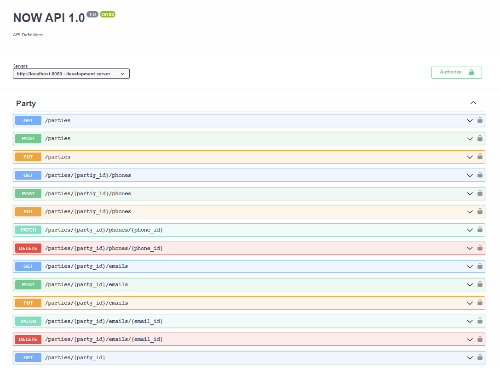

This project explores using [OpenAPI](https://www.openapis.org/) to document the NOW API and the data model used in API calls and it's deployed on an Azure AKS Pod using NodeJS. The Now Platform already provides various [REST APIs](https://docs.servicenow.com/bundle/tokyo-application-development/page/build/applications/concept/api-rest.html), which are active by default. These APIs provide the ability to interact with various ServiceNow functionality within your application. Such functionality includes the ability to perform create, read, update, and delete (CRUD) operations on existing tables (Table API), insert data into, retrieve information from, and run transforms against a MetricBase database (MetricBase Time Series API, and many others. 